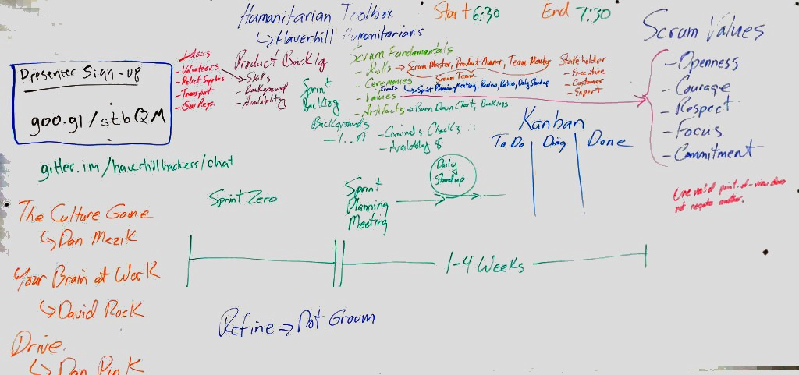

# Scrum: Values and Getting Value

If you are doing Scrum, but not getting much value from it, this talk is for you. It starts with a review of Scrum Fundamentals, then describes common scenarios where Scrum gets off-course. Bring your questions!

This will be a change from our normally technical talks and give a peek into development processes used at some companies. 

### Speaker

Randy Bone ([meetup][meetup] / [twitter][twitter])

### Scrum Board

### Video

[Watch on youtube.](https://www.youtube.com/watch?v=XYHrlMzLIvM)

### When?

Wednesday, Feb 3, 2016, 6:15 PM - 8:15 PM

### Where?

Haverhil Hackspace (Floor 6)
143 Essex Street, Suite 600 Haverhill, MA

[meetup]:  http://www.meetup.com/HaverhillHackers/members/1989295/
[twitter]: https://twitter.com/randy1200
